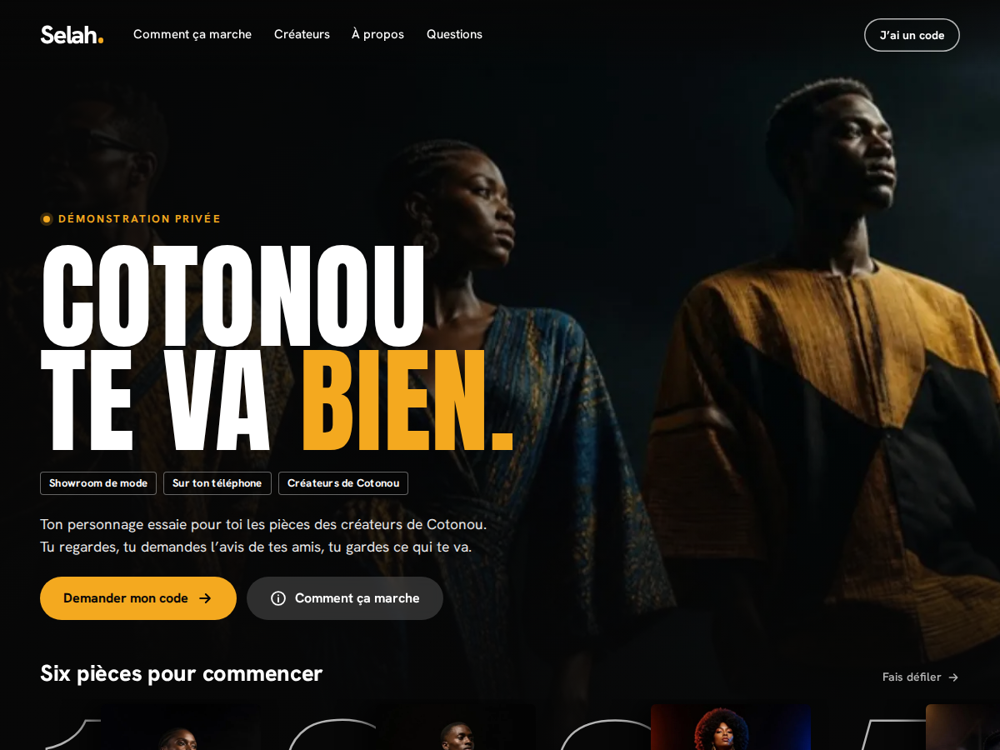

# Selah — site vitrine WordPress

Site WordPress de présentation pour [Selah](https://selah-ebon.vercel.app/), le showroom de mode où
**ton personnage essaie pour toi les pièces des créateurs de Cotonou**.

Le design s'inspire des plateformes de streaming : fond noir, grandes images plein cadre,
titres d'affiche, rangées de vignettes qu'on fait défiler, un seul accent safran (`#f4a91f`).
Titres en Anton, textes en Hanken Grotesk.



## Voir le site sans l'installer

[**Ouvrir la démonstration dans WordPress Playground**](https://playground.wordpress.net/?blueprint-url=https://raw.githubusercontent.com/Mardoch456Mario/Selah/main/blueprint.json)

Le lien lance un vrai WordPress dans le navigateur (aucune installation, rien n'est publié) :
il installe le thème et l'extension depuis la branche `main` de ce dépôt, crée les pages et
vous connecte à l'administration. Le premier chargement prend environ une minute. Tout ce que
vous y modifiez disparaît en fermant l'onglet. La recette est dans `blueprint.json`.

## Ce que contient le dépôt

```
wp-content/themes/selah/        Thème « Selah » (thème par blocs, modifiable dans l'éditeur)
  theme.json                    Couleurs, typographie, espacements, boutons
  templates/ parts/             Modèles de pages, en-tête, pied de page
  patterns/                     Sections et pages prêtes à l'emploi (compositions « Selah »)
  inc/installation.php          Création des pages en un clic
  assets/                       Polices Anton et Hanken Grotesk, icône, images (WebP)
wp-content/plugins/selah-core/  Extension « Selah Core » : formulaire de demande d'accès
scripts/                        Installation (WP-CLI) et fabrication des .zip
docker-compose.yml              WordPress local avec Docker
```

### Les pages du site

| Page | Adresse | Contenu |
|---|---|---|
| Accueil | `/` | Affiche plein écran, rangées « Six pièces pour commencer » et « Pour chaque occasion », trois épisodes, entre amis, créateurs, questions, formulaire |
| Créateurs | `/createurs/` | Pour les ateliers et marques de Cotonou (au vouvoiement), matières, trois étapes, formulaire « créateur » |
| À propos | `/a-propos/` | L'idée de Selah, le fil safran du kanvô, les créateurs |
| Questions fréquentes | `/questions-frequentes/` | Questions en accordéon |
| Demander un accès | `/demande-acces/` | Formulaire de demande de code |
| Confidentialité | `/confidentialite/` | Usage des données du formulaire |
| Journal | `/journal/` | Articles (actualités) |

Les boutons « J'ai un code », « Ouvrir Selah »… mènent à l'application.

## Mettre le site en ligne chez un hébergeur

1. **Fabriquer les deux archives** (ou compresser vous-même les dossiers `selah` et `selah-core`) :
   ```bash
   ./scripts/empaqueter.sh     # crée dist/selah.zip et dist/selah-core.zip
   ```
2. Installer WordPress chez l'hébergeur (installation en un clic chez la plupart d'entre eux).
3. **Apparence › Thèmes › Ajouter un thème › Téléverser** : `selah.zip`, puis **Activer**.
4. **Extensions › Ajouter › Téléverser** : `selah-core.zip`, puis **Activer**.
5. Cliquer sur **« Créer les pages du site »** dans le bandeau qui apparaît. Les pages, la page
   d'accueil, le journal et les adresses lisibles sont réglés automatiquement.
6. **Réglages › Général** : titre « Selah », langue « Français », fuseau horaire « Porto-Novo ».
7. **Réglages › Selah** : e-mail qui reçoit les demandes, et adresse de l'application si elle change.

## Essayer en local

Avec Docker :

```bash
docker compose up -d
WP="docker compose run --rm -T cli wp" ADMIN_PASSWORD=choisissez-un-mot-de-passe ./scripts/installer.sh
```

Puis ouvrir <http://localhost:8080> (administration : `/wp-admin`, identifiant `admin`).

Avec un WordPress déjà installé et [WP-CLI](https://wp-cli.org/) :

```bash
WP="wp --path=/chemin/vers/wordpress" SITE_URL=http://mon-site.local ./scripts/installer.sh
```

Le script installe le français, active le thème et l'extension, règle le fuseau horaire de Cotonou,
crée les pages et active les adresses lisibles. Il peut être relancé sans risque.

## Modifier le site

- **Textes des pages** : *Pages*, puis ouvrir la page dans l'éditeur. Le résumé affiché dans les
  résultats de recherche se modifie dans le panneau *Extrait* de la page.
- **Page d'accueil, en-tête, pied de page** : *Apparence › Éditeur › Modèles › Page d'accueil*
  (ou *Compositions › En-tête / Pied de page*).
- **Couleurs et typographie** : *Apparence › Éditeur › Styles*.
- **Ajouter une section** : dans l'éditeur, bouton « + » › *Compositions* › catégorie **Selah**
  (affiche et rangées, trois épisodes, plein cadre, carte créateurs, questions, demande de code).
- **Changer une image** : sélectionner le bloc *Couverture* (affiches, vignettes) ou *Image*, puis
  *Remplacer* ; le point focal règle le recadrage.
- **Lien vers l'application** : donner l'adresse `#selah-app` à un bouton ou à un lien ; le site le
  remplace par l'adresse réglée dans *Réglages › Selah*.
- **Formulaire** : le code court `[selah_demande_acces]` l'affiche n'importe où ;
  `[selah_demande_acces profil="createur"]` présélectionne « Créateur·rice », et
  `registre="vous"` passe ses textes au vouvoiement (page Créateurs).

## Les demandes d'accès

Chaque envoi du formulaire arrive dans le menu **Demandes d'accès** de l'administration
(avec une pastille pour les nouvelles) et par e-mail.

- Fiche de suivi : étape (nouvelle, contactée, code envoyé, close) et notes internes.
- **Exporter en CSV** (bouton au-dessus de la liste) pour envoyer les codes par lot.
- Protection contre les robots : champ piège, délai minimal, 5 demandes par heure et par connexion.
  Pas de nonce, pour que le formulaire fonctionne même sur des pages mises en cache.
- Données personnelles : les outils *Exporter / Effacer les données personnelles* de WordPress
  prennent en charge ces demandes.

Certains hébergeurs n'envoient pas les e-mails de WordPress : dans ce cas, installer une
extension SMTP (par exemple *WP Mail SMTP*). Les demandes restent de toute façon visibles dans
l'administration.

## À relire avant la mise en ligne

- **Les textes** ont été écrits à partir de la description publique de Selah (l'application est
  en démonstration privée). Relisez-les, en particulier les questions fréquentes et les étapes
  pour les créateurs.
- **La page Confidentialité** est un point de départ : faites-la valider, surtout si vous
  ajoutez une mesure d'audience (le site n'en a pas aujourd'hui).
- **Les images** ont été générées par IA (Canva) pour illustrer la mode de Cotonou : les
  personnes et les pièces représentées n'existent pas. Remplacez-les dès que possible par de
  vraies photos des créations et par des captures de l'application. Les intitulés des vignettes
  (« Robe kanvô », « Boubou brodé »…) décrivent ces images, pas un catalogue réel.

## Et Vercel ?

Ce site est un site **WordPress** (PHP et base de données) : il s'installe chez un hébergeur
WordPress, pas sur Vercel. Ce dépôt étant relié au projet Vercel de l'application, le fichier
`vercel.json` (`"git": {"deploymentEnabled": false}`) demande à Vercel de ne rien déployer
depuis ce dépôt : l'application en ligne n'est jamais remplacée par ce site. Si un jour
l'application elle-même est déployée depuis ce dépôt, il faudra retirer ce fichier.

## Détails techniques

- WordPress 6.6 ou plus récent (testé sur 7.1.2), PHP 7.4 ou plus récent.
- Thème par blocs, sans constructeur de pages ni dépendance externe : les polices sont hébergées
  dans le thème (licence SIL OFL, voir `assets/fonts/*/OFL.txt`), aucun appel à un service tiers.
- Les 10 images pèsent 656 Ko au total (WebP).
- Code conforme aux règles *WordPress-Extra* (PHP_CodeSniffer).
